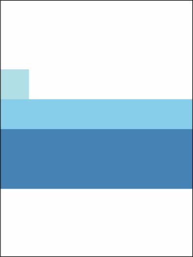
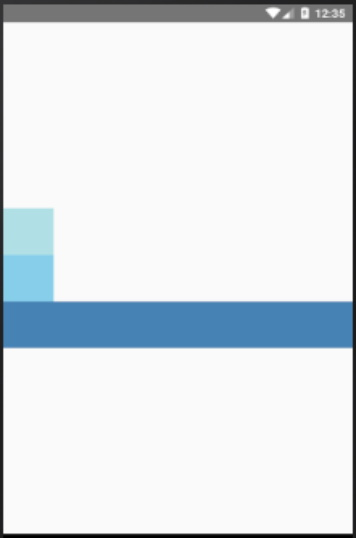

# Exercício 1 - Usando os poderes de mais de 8000 do Flexbox

Crie um componente funcional que renderize a seguinte tela usando o Flexbox para posicionar os elementos.

# Exercício 2 - Usando os poderes de mais de 8000 do Flexbox pela segunda vez

Crie um componente de classe com o nome de FlexboxPower que renderize a seguinte tela usando o Flexbox para posicionar os elementos.

